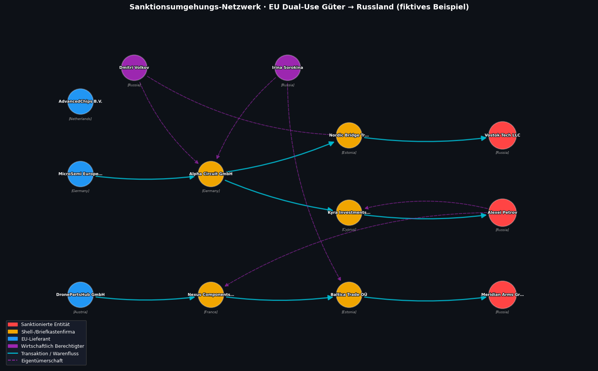

# Sanktionsverstöße, Geldwäsche und Finanzbetrug aufspüren mit Neo4j

*Wie Graph-Datenbanken dort brillieren, wo SQL und NoSQL aufhören zu funktionieren — mit einem vollständigen Python-Beispiel.*

---

## Warum Graphen? Das Problem mit relationalen Daten

Betrug, Geldwäsche und Sanktionsumgehung haben eines gemeinsam: Sie verstecken sich **in den Verbindungen** zwischen Entitäten, nicht in den Entitäten selbst. Eine einzelne Transaktion zwischen zwei Firmen mag harmlos wirken — erst wenn man drei Schritte zurücktritt und das gesamte Netzwerk betrachtet, wird die Struktur sichtbar.

Genau hier trennen sich Graph-Datenbanken wie [Neo4j](https://neo4j.com/) fundamental von klassischen Ansätzen.

### Neo4j vs. SQL vs. NoSQL — die wesentlichen Unterschiede

Relationale Datenbanken (PostgreSQL, MySQL) speichern Daten in starren Tabellen und verbinden sie über JOINs — effizient für direkte Abfragen, aber exponentiell langsamer bei tief verschachtelten Beziehungen über mehrere Ebenen. Wer in SQL herausfinden will, ob Firma A über drei Zwischenstellen mit einer sanktionierten Person verbunden ist, so wird er bei großen Datensätzen große Query Ausführungsdauer in Kauf nehmen müssen. Bei Ad-Hoc analytischen Abfragen, ist die Latenz akzeptabel. Braucht man aber eine real-time analytische Fähigkeit, so wird SQL schnell an eigene Grenzen stößen.

NoSQL-Datenbanken (MongoDB, Cassandra) lösen das Skalierungsproblem bei unstrukturierten oder hoch-volumigen Daten, sind aber nicht für relationale Traversierungen optimiert — eine Multi-Hop-Pfadsuche ist kein natives Paradigma dieser Systeme.

[Neo4j](https://neo4j.com/product/neo4j-graph-database/) hingegen speichert Knoten (Personen, Firmen, Konten) und Kanten (Transaktionen, Eigentümerschaft, Verbindungen) als native Graphstrukturen im Speicher. Ein Beziehungssprung — ob zwei oder zwanzig Ebenen tief — kostet konstante Zeit, weil die Verbindungen physikalisch als Pointer im Graphen existieren, nicht als JOINs, die zur Laufzeit berechnet werden. Das macht Neo4j für Financial Crime Analysis, Know-Your-Customer (KYC) und Sanctions Screening zur überlegenen Wahl.

---

## Sanktionsverstöße, Geldwäsche & Finanzbetrug — Definitionen und reale Muster

### Sanktionsumgehung: Wenn Dual-Use-Güter über Umwege reisen

Sanktionen sind wirtschaftliche oder rechtliche Beschränkungen, die Staaten oder internationale Organisationen gegen Länder, Unternehmen oder Personen verhängen. 2022 belegten die EU, die USA, Großbritannien und andere Staaten Russland mit umfassenden Exportrestriktionen — darunter ein striktes Verbot für sogenannte *Dual-Use-Güter*: Technologie, die sowohl zivil als auch militärisch genutzt werden kann. Dazu gehören FPGA-Chips, Trägheitssensoren, bestimmte Halbleiter und Drohnenkomponenten.

Investigative Berichte haben gezeigt, wie dieses Verbot systematisch umgangen wird. Das Muster ist immer ähnlich: Ein EU-Lieferant verkauft Bauteile an eine unauffällig klingende Firma in Estland, Lettland oder Deutschland. Diese Firma tritt nach außen als lokales Handelsunternehmen auf, ist aber im Eigentum sanktionierter Staatsangehöriger oder von sanktionierten Strukturen — oft über Briefkastenfirmen auf Zypern oder in anderen Offshore-Jurisdiktionen. Die Güter landen letztlich im saktionierten Gebiet.

**Technisch definiert** handelt es sich bei Sanktionsumgehung um das Vorhandensein eines gerichteten Pfades im Transaktionsgraphen von einer nicht-sanktionierten Quellentität zu einer sanktionierten Zielentität, wobei mindestens eine Zwischenentität als Verschleierungsschicht fungiert: `(LegalSupplier)-[:TRANSFERRED_TO*1..N]->(SanctionedTarget)`. Je mehr Hops, desto schwerer die manuelle Erkennung — und desto mächtiger die Graph-Traversierung. Mehr Hops (Zwischen-Entitäten) auch mögliche Datenlücken, da Jurisdikationen unkooperativ agieren.

### Geldwäsche: Der dreiaktige Kreislauf

Geldwäsche verfolgt das Ziel, kriminell erlangtes Geld in den legalen Finanzkreislauf einzuschleusen. Die [Financial Action Task Force (FATF)](https://www.fatf-gafi.org/) beschreibt drei klassische Phasen: *Placement* (Einspeisung von Bargeld), *Layering* (Verschleierung durch komplexe Transaktionsketten) und *Integration* (Rückführung als scheinbar legale Einnahmen).

Das Hauptwerkzeug dabei sind Offshore-Strukturen: Eine Person einem Hochrisikoland gründet oder kauft Briefkastenfirmen auf Zypern, in den British Virgin Islands oder auf den Cayman Islands — Jurisdiktionen mit geringer Transparenzpflicht gegenüber Behörden. Diese Shells überweisen sich gegenseitig Gelder als „Beratungshonorare", „Lizenzgebühren" oder „Kapitaleinlagen", ohne zugrundeliegende wirtschaftliche Substanz. Das *Layering* hinterlässt eine scheinbar legitime Papierspur, die für manuelle Prüfung nahezu undurchdringlich ist. Kleinere Akteure agieren dagegen mit physischen Geschäften wie Autowäsche/Casinos oder fiktive Digital-Güter mit geringeren Besteuerung.

**Technisch** ist eine Geldwäschestruktur ein gerichteter Teilgraph mit zyklischen oder vielschichtigen Transferpfaden, bei dem Knotenattribute wie `country` auf bekannte Offshore-Jurisdiktionen hinweisen und die wirtschaftlich Berechtigten (`Ultimate Beneficial Owner`, UBO) — via `OWNS`-Kanten — risikobehaftete Personen sind, die keine direkten Verbindungen zu sanktionierten Entitäten auf der Oberfläche aufweisen, aber durch Graph-Traversierung auffindbar werden. Für kleinere Akteure dagegen ist eine detailiertere Analyse der Bilanz des Unternehmens sowie der granularen Transaktionen der Bankkonten des Unternehmens.

### Offshore-Leaks: Die offene Datenbasis

Das [International Consortium of Investigative Journalists (ICIJ)](https://icij.org) veröffentlicht seit den Panama Papers 2016 strukturierte Daten zu Offshore-Firmen aus Leaks wie den Pandora Papers, FinCEN Files und OpenCorporates. Die [ICIJ Offshore Leaks Database](https://offshoreleaks.icij.org/) ist öffentlich zugänglich und enthält Millionen von Knoten und Kanten — genau das richtige Format für eine Graphdatenbank. Ergänzend bietet [OpenSanctions.org](https://www.opensanctions.org/) eine maschinenlesbare, täglich aktualisierte Sanktionsliste.

---

## Das konkrete Beispiel: Operation „Silicon Shield"

> **Disclaimer:** Alle folgenden Firmen- und Personennamen sind **vollständig fiktiv** und dienen ausschließlich der technischen Veranschaulichung. Sie bilden jedoch bekannte, reale Muster aus investigativen Berichten nach.

### Der Sachverhalt

Stellen wir uns folgendes Szenario vor: Der deutsche Halbleiterhändler **MicroSemi Europe AG** verkauft FPGA-Chips — Hochleistungsprozessoren, die in der militärischen Signalelektronik eingesetzt werden — an die in Frankfurt registrierte **Alpha Circuit GmbH**. Diese Firma erscheint im Handelsregister unauffällig, ihr tatsächlicher Eigentümer ist jedoch der russische Staatsbürger **Dmitri Volkov**, der sie über eine zypriotische Holding kontrolliert. Alpha Circuit reicht die Chips über eine weitere estnische Briefkastenfirma (**Nordic Bridge Trading Ltd**) weiter, wo sie letztlich bei **Vostok Tech LLC** in Moskau landen — einem Unternehmen auf der EU-Sanktionsliste.

Parallel dazu läuft eine Geldwäschestruktur: Die ebenfalls von sanktionierten Personen kontrollierte **Kyra Investments Ltd** auf Zypern empfängt Millionenbeträge aus Alpha Circuit als angebliche „Beratungshonorare" und transferiert sie anschließend direkt an die sanktionierte Person **Alexei Petrov**.

### Wie wir mit Neo4j vorgehen

Das Ziel ist, diesen Ring mit Cypher-Queries schrittweise aufzudecken:

1. **Query 1** sucht nach direkten Transfers zu sanktionierten Entitäten — low-hanging fruits.
2. **Query 2** analysiert die Eigentümerschaftsstrukturen: Welche EU-Firmen werden von russischen Personen kontrolliert?
3. **Query 3** verbindet beide Dimensionen: Sanktionierte Personen, die über eigene Shells Geld fließen lassen.
4. **Query 4** findet alle vollständigen Lieferkettenpfade vom legitimen Lieferanten bis zum sanktionierten Endempfänger — das ist der endgültige forensische Beweis für indirekte Sanktionsumgehung.

Das Schöne an Graph-Traversierung: Für jeden dieser Schritte schreiben wir in Cypher einen einzigen, lesbaren Musterabgleich — ohne Subqueries, ohne Tabellen-JOINs, ohne explizite Schleifen.

---

## Hands-on: Neo4j mit Python und JupyterLab

### Voraussetzungen

```bash
# Neo4j lokal starten (z.B. via Docker)
docker run \
  --name neo4j-sanctions \
  -p 7474:7474 -p 7687:7687 \
  -e NEO4J_AUTH=neo4j/password \
  neo4j:5.18

# Python-Abhängigkeiten installieren
mkdir neo4j-sanctions && cd neo4j-sanctions
uv init 
uv venv
source ./venv/bin/activate
uv add neo4j pandas matplotlib networkx yfiles_jupyter_graphs_for_neo4j
```

---

### Notebook-Zelle 1 — Imports & Datenbankverbindung

```python
# ─── Imports ─────────────────────────────────────────────────────────────────
from neo4j import GraphDatabase
import pandas as pd
import networkx as nx
import matplotlib.pyplot as plt
import matplotlib.patches as mpatches
import matplotlib.patheffects as pe
from yfiles_jupyter_graphs_for_neo4j import Neo4jGraphWidget

# ─── Verbindungsparameter ─────────────────────────────────────────────────────
NEO4J_URI      = "neo4j://localhost:7687"
NEO4J_USER     = "neo4j"
NEO4J_PASSWORD = "password"   # ← euer lokales Passwort hier eintragen

driver = GraphDatabase.driver(NEO4J_URI, auth=(NEO4J_USER, NEO4J_PASSWORD))
visualize_cypher = Neo4jGraphWidget(driver)

# Verbindungstest
with driver.session() as session:
    result = session.run("RETURN 'Neo4j connected ✓' AS status")
    print(result.single()["status"])
```

Der offizielle [Neo4j Python Driver](https://neo4j.com/docs/api/python-driver/current/) kommuniziert über das Bolt-Protokoll mit der Datenbank. `GraphDatabase.driver()` erzeugt einen thread-sicheren Connection-Pool — geeignet für Produktivbetrieb und Batch-Analysen gleichermaßen. `Neo4jGraphWidget` ist das interaktive Visualisierungs-Widget, das wir später für die Kartenansicht nutzen.

---

### Notebook-Zelle 2 — Schema & Dataimport

Wir legen zunächst einen **eindeutigen Index** auf die Entitäts-IDs an — das verhindert Duplikate bei wiederholtem Import und beschleunigt Lookups erheblich. Dann importieren wir unsere fiktiven Datensätze per `MERGE`-Statement (idempotent, kein Duplikat bei erneutem Ausführen):

```python
# ─── Graph leeren (Achtung: löscht ALLE Knoten & Kanten!) ────────────────────
with driver.session() as session:
    session.run("MATCH (n) DETACH DELETE n")
    print("Graph geleert.")

# ─── Eindeutige Constraints / Indizes anlegen ─────────────────────────────────
constraints = [
    "CREATE CONSTRAINT IF NOT EXISTS FOR (e:Entity) REQUIRE e.id IS UNIQUE",
    "CREATE INDEX IF NOT EXISTS FOR (e:Entity) ON (e.country)",
    "CREATE INDEX IF NOT EXISTS FOR (e:Entity) ON (e.sanctioned)",
]
with driver.session() as session:
    for c in constraints:
        session.run(c)
print("Constraints & Indizes angelegt.")
```

```python
# ─── Fiktives Datensample ─────────────────────────────────────────────────────
# Modelliert ein Sanktionsumgehungs-Netzwerk:
# EU-Lieferant → Shell-Ring (EST/FR/CY) → sanktionierte russische Entität

ALL_NODES = [
    # Sanktionierte Entitäten (Russland)
    {"id": "SE001", "name": "Vostok Tech LLC",      "country": "Russia", "type": "Company", "sanctioned": True,  "location_x": 37.6176, "location_y": 55.7558},
    {"id": "SE002", "name": "Alexei Petrov",          "country": "Russia", "type": "Person",  "sanctioned": True,  "location_x": 37.6176, "location_y": 55.7558},
    {"id": "SE003", "name": "Meridian Arms Group",    "country": "Russia", "type": "Company", "sanctioned": True,  "location_x": 37.6176, "location_y": 55.7558},
    # Shell-/Briefkastenfirmen (EU)
    {"id": "SH001", "name": "Nordic Bridge Trading Ltd", "country": "Estonia",  "type": "Company", "sanctioned": False, "location_x": 25.7482, "location_y": 58.5953},
    {"id": "SH002", "name": "Alpha Circuit GmbH",         "country": "Germany",  "type": "Company", "sanctioned": False, "location_x": 10.4515, "location_y": 51.1657},
    {"id": "SH003", "name": "Baltica Trade OÜ",           "country": "Estonia",  "type": "Company", "sanctioned": False, "location_x": 25.7482, "location_y": 58.5953},
    {"id": "SH004", "name": "Nexus Components SARL",      "country": "France",   "type": "Company", "sanctioned": False, "location_x":  2.2137, "location_y": 46.2276},
    {"id": "SH005", "name": "Kyra Investments Ltd",       "country": "Cyprus",   "type": "Company", "sanctioned": False, "location_x": 33.4299, "location_y": 35.1264},
    # Wirtschaftlich Berechtigte (verdeckt)
    {"id": "BO001", "name": "Dmitri Volkov",   "country": "Russia", "type": "Person", "sanctioned": False, "location_x": 37.6176, "location_y": 55.7558},
    {"id": "BO002", "name": "Irina Sorokina",  "country": "Russia", "type": "Person", "sanctioned": False, "location_x": 37.6176, "location_y": 55.7558},
    # Legitime EU-Lieferanten (unwissentlich beteiligt)
    {"id": "SUP001", "name": "MicroSemi Europe AG",  "country": "Germany",     "type": "Company", "sanctioned": False, "location_x": 10.4515, "location_y": 51.1657},
    {"id": "SUP002", "name": "DronePartsHub GmbH",   "country": "Austria",     "type": "Company", "sanctioned": False, "location_x": 14.5501, "location_y": 47.5162},
    {"id": "SUP003", "name": "AdvancedChips B.V.",   "country": "Netherlands", "type": "Company", "sanctioned": False, "location_x":  5.2913, "location_y": 52.1326},
]

TRANSACTIONS = [
    {"id": "TX001", "from": "SH001", "to": "SE001",  "amount": 480000,  "currency": "EUR", "date": "2024-03-15", "goods": "FPGA-Chips (Dual-Use)"},
    {"id": "TX002", "from": "SH002", "to": "SH001",  "amount": 510000,  "currency": "EUR", "date": "2024-02-20", "goods": "FPGA-Chips (Dual-Use)"},
    {"id": "TX003", "from": "SUP001","to": "SH002",  "amount": 490000,  "currency": "EUR", "date": "2024-01-18", "goods": "FPGA-Chips (Dual-Use)"},
    {"id": "TX004", "from": "SH003", "to": "SE003",  "amount": 270000,  "currency": "EUR", "date": "2024-04-02", "goods": "Drohnen-Komponenten"},
    {"id": "TX005", "from": "SH004", "to": "SH003",  "amount": 285000,  "currency": "EUR", "date": "2024-03-10", "goods": "Drohnen-Komponenten"},
    {"id": "TX006", "from": "SUP002","to": "SH004",  "amount": 260000,  "currency": "EUR", "date": "2024-02-28", "goods": "Drohnen-Komponenten"},
    {"id": "TX007", "from": "SH005", "to": "SE002",  "amount": 1200000, "currency": "EUR", "date": "2024-05-01", "goods": "Überweisung (Tarnung Gewinne)"},
    {"id": "TX008", "from": "SH002", "to": "SH005",  "amount": 1100000, "currency": "EUR", "date": "2024-04-10", "goods": "Beratungshonorar"},
]

OWNERSHIPS = [
    {"owner": "BO001", "company": "SH001", "share_pct": 100},
    {"owner": "BO001", "company": "SH002", "share_pct": 60},
    {"owner": "BO002", "company": "SH002", "share_pct": 40},
    {"owner": "BO002", "company": "SH003", "share_pct": 100},
    {"owner": "SE002", "company": "SH005", "share_pct": 100},  # ⚠ sanktionierte Person besitzt Offshore-Shell!
    {"owner": "SE002", "company": "SH004", "share_pct": 51},
]

ASSOCIATIONS = [
    {"person": "SE002", "company": "SE001", "role": "Director"},
    {"person": "BO001", "company": "SE001", "role": "Geschäftspartner"},
    {"person": "BO002", "company": "SE003", "role": "Geschäftspartner"},
]

# ─── Cypher: Knoten importieren ───────────────────────────────────────────────
with driver.session() as session:
    for node in ALL_NODES:
        label = "Person" if node["type"] == "Person" else "Company"
        cypher = f"""
            MERGE (e:Entity:{label} {{id: $id}})
            SET e.name       = $name,
                e.country    = $country,
                e.sanctioned = $sanctioned,
                e.location_x = $location_x,
                e.location_y = $location_y
        """
        session.run(cypher, **node)

    # Transaktionen
    for tx in TRANSACTIONS:
        session.run("""
            MATCH (a:Entity {id: $from_id}), (b:Entity {id: $to_id})
            MERGE (a)-[r:TRANSFERRED_TO {id: $id}]->(b)
            SET r.amount   = $amount,
                r.currency = $currency,
                r.date     = $date,
                r.goods    = $goods
        """, from_id=tx["from"], to_id=tx["to"], **{k:v for k,v in tx.items() if k not in ("from","to")})

    # Eigentümerschaft
    for o in OWNERSHIPS:
        session.run("""
            MATCH (p:Entity {id: $owner}), (c:Entity {id: $company})
            MERGE (p)-[r:OWNS]->(c)
            SET r.share_pct = $share_pct
        """, **o)

    # Verbindungen/Rollen
    for a in ASSOCIATIONS:
        session.run("""
            MATCH (p:Entity {id: $person}), (c:Entity {id: $company})
            MERGE (p)-[r:ASSOCIATED_WITH]->(c)
            SET r.role = $role
        """, **a)

# Kurzcheck
with driver.session() as session:
    counts = session.run("""
        MATCH (n:Entity) RETURN labels(n) AS label, count(n) AS cnt
    """).data()
    for row in counts:
        print(f"  {row['label']}: {row['cnt']} Knoten")
    tx_count = session.run("MATCH ()-[r:TRANSFERRED_TO]->() RETURN count(r) AS c").single()["c"]
    print(f"  TRANSFERRED_TO: {tx_count} Kanten")

print("\n✅ Daten erfolgreich in Neo4j importiert.")
```

Der `MERGE`-Befehl ist in Cypher das Äquivalent zu `INSERT OR IGNORE` — idempotent und damit sicher für wiederholten Aufruf. Das Graph-Schema ergibt sich organisch aus den Daten; kein Schema-Migration-Skript wie in SQL nötig. Die `location_x`/`location_y`-Koordinaten (Längen- und Breitengrad) werden später für die Kartenvisualisierung benötigt.

---

### Notebook-Zelle 3 — Query 1: Direkte Transaktionen zu sanktionierten Entitäten

```python
# ─── Query 1: Direkte Transaktionen zu sanktionierten Entitäten ───────────────
QUERY_1 = """
MATCH (sender:Entity)-[tx:TRANSFERRED_TO]->(target:Entity {sanctioned: true})
RETURN
    sender.name    AS Absender,
    sender.country AS Absender_Land,
    tx.amount      AS Betrag_EUR,
    tx.goods       AS Güter,
    tx.date        AS Datum,
    target.name    AS Empfänger
ORDER BY tx.amount DESC
"""

with driver.session() as session:
    rows = session.run(QUERY_1).data()

df_q1 = pd.DataFrame(rows)
df_q1["Betrag_EUR"] = df_q1["Betrag_EUR"].apply(lambda x: f"{x:,.0f} €")
print("Direkte Transfers zu sanktionierten Entitäten:")
display(df_q1)
```

**Ergebnis:**

| Absender | Absender_Land | Betrag_EUR | Güter | Datum | Empfänger |
|---|---|---|---|---|---|
| Kyra Investments Ltd | Cyprus | 1.200.000 € | Überweisung (Tarnung Gewinne) | 2024-05-01 | Alexei Petrov |
| Nordic Bridge Trading Ltd | Estonia | 480.000 € | FPGA-Chips (Dual-Use) | 2024-03-15 | Vostok Tech LLC |
| Baltica Trade OÜ | Estonia | 270.000 € | Drohnen-Komponenten | 2024-04-02 | Meridian Arms Group |

Drei direkte Treffer — aber die Absender selbst erscheinen unverdächtig. Ohne Eigentümerschaftsdaten ist nicht erkennbar, dass hinter Kyra Investments und Nordic Bridge dieselben russischen Akteure stecken.

---

### Notebook-Zelle 4 — Query 2: Shell-Firmen mit russischen Eigentümern

```python
# ─── Query 2: Shells mit russischen wirtschaftlich Berechtigten ───────────────
QUERY_2 = """
MATCH (owner:Entity {country: 'Russia'})-[o:OWNS]->(shell:Entity)
WHERE shell.country <> 'Russia'
RETURN
    owner.name    AS Eigentümer,
    CASE owner.sanctioned WHEN true THEN '⚠ SANKTIONIERT' ELSE 'nicht sanktioniert' END AS Status,
    o.share_pct   AS Anteil_Pct,
    shell.name    AS Shell_Firma,
    shell.country AS Shell_Land
ORDER BY owner.sanctioned DESC, o.share_pct DESC
"""

with driver.session() as session:
    rows = session.run(QUERY_2).data()

df_q2 = pd.DataFrame(rows)
print("Shell-Firmen unter russischer Kontrolle:")
display(df_q2)
```

**Ergebnis:**

| Eigentümer | Status | Anteil_Pct | Shell_Firma | Shell_Land |
|---|---|---|---|---|
| Alexei Petrov | ⚠ SANKTIONIERT | 100 | Kyra Investments Ltd | Cyprus |
| Alexei Petrov | ⚠ SANKTIONIERT | 51 | Nexus Components SARL | France |
| Dmitri Volkov | nicht sanktioniert | 100 | Nordic Bridge Trading Ltd | Estonia |
| Irina Sorokina | nicht sanktioniert | 100 | Baltica Trade OÜ | Estonia |
| Dmitri Volkov | nicht sanktioniert | 60 | Alpha Circuit GmbH | Germany |
| Irina Sorokina | nicht sanktioniert | 40 | Alpha Circuit GmbH | Germany |

Sechs EU-registrierte Firmen unter russischer Kontrolle — darunter die entscheidende Verbindung: **Alexei Petrov (sanktioniert)** hält 100 % an Kyra Investments Ltd (Zypern) und 51 % an Nexus Components SARL (Frankreich). Das ist die `OWNS`-Kante, die jeden Compliance-Alarm auslösen müsste.

---

### Notebook-Zelle 5 — Query 3: Sanktionierte Person → Shell → Geldfluss

```python
# ─── Query 3: Sanktionierte Person → eigene Shell → ausgehende Transaktionen ──
QUERY_3 = """
MATCH (sp:Person {sanctioned: true})
      -[:OWNS]->(shell:Entity)
      -[tx:TRANSFERRED_TO]->(target:Entity)
RETURN
    sp.name     AS Sanktionierte_Person,
    shell.name  AS Shell_Firma,
    shell.country AS Shell_Land,
    tx.amount   AS Betrag_EUR,
    tx.goods    AS Güter,
    target.name AS Empfänger,
    CASE target.sanctioned WHEN true THEN '⚠ SANKTIONIERT' ELSE 'unverdächtig' END AS Empfänger_Status
ORDER BY tx.amount DESC
"""

with driver.session() as session:
    rows = session.run(QUERY_3).data()

df_q3 = pd.DataFrame(rows)
if len(rows) > 0:
    df_q3["Betrag_EUR"] = df_q3["Betrag_EUR"].apply(lambda x: f"{x:,.0f} €")
    print("Geldflüsse über von sanktionierten Personen kontrollierte Shells:")
else:
    print("Keine Geldflüsse gefunden")
display(df_q3)
```

**Ergebnis:**

| Sanktionierte_Person | Shell_Firma | Shell_Land | Betrag_EUR | Güter | Empfänger | Empfänger_Status |
|---|---|---|---|---|---|---|
| Alexei Petrov | Kyra Investments Ltd | Cyprus | 1.200.000 € | Überweisung (Tarnung Gewinne) | Alexei Petrov | ⚠ SANKTIONIERT |
| Alexei Petrov | Nexus Components SARL | France | 285.000 € | Drohnen-Komponenten | Baltica Trade OÜ | unverdächtig |

Diese Query verbindet zwei Kantentypen in einem Atemzug: `OWNS` und `TRANSFERRED_TO`. In SQL wären das drei Tabellen-JOINs. In Cypher ist es ein natürliches Muster, das der tatsächlichen Struktur der Realität entspricht. Der erste Treffer ist besonders brisant: Alexei Petrov überweist sich über seine eigene Offshore-Shell letztlich selbst Geld — ein klassisches Geldwäsche-Schema.

---

### Notebook-Zelle 6 — Query 4: Vollständige Lieferkettenpfade

```python
# ─── Query 4: Vollständige Pfade EU-Lieferant → sanktionierte Entität ─────────
QUERY_4 = """
MATCH path = (supplier:Entity)-[:TRANSFERRED_TO*1..4]->(target:Entity {sanctioned: true})
WHERE NOT supplier.sanctioned
  AND NOT EXISTS {
      MATCH (x:Entity)-[:TRANSFERRED_TO]->(supplier)
      WHERE NOT x.sanctioned = false
  }
WITH path,
     [n IN nodes(path) | n.name + ' [' + n.country + ']'] AS Stationen,
     reduce(total = 0, r IN relationships(path) | total + r.amount) AS Gesamtbetrag,
     length(path) AS Hops
RETURN Stationen, Hops, Gesamtbetrag
ORDER BY Gesamtbetrag DESC
"""

with driver.session() as session:
    rows = session.run(QUERY_4).data()

df_q4 = pd.DataFrame(rows)
df_q4["Gesamtbetrag"] = df_q4["Gesamtbetrag"].apply(lambda x: f"{x:,.0f} €")
df_q4["Pfad"] = df_q4["Stationen"].apply(lambda s: " → ".join(s))
display(df_q4[["Pfad", "Hops", "Gesamtbetrag"]])

print(f"\n🔴 {len(df_q4)} Sanktionsumgehungs-Pfade entdeckt!")
```

**Ergebnis:**

| Pfad | Hops | Gesamtbetrag |
|---|---|---|
| MicroSemi Europe AG [Germany] → Alpha Circuit GmbH [Germany] → Kyra Investments Ltd [Cyprus] → Alexei Petrov [Russia] | 3 | 2.790.000 € |
| Alpha Circuit GmbH [Germany] → Kyra Investments Ltd [Cyprus] → Alexei Petrov [Russia] | 2 | 2.300.000 € |
| MicroSemi Europe AG [Germany] → Alpha Circuit GmbH [Germany] → Nordic Bridge Trading Ltd [Estonia] → Vostok Tech LLC [Russia] | 3 | 1.480.000 € |
| Kyra Investments Ltd [Cyprus] → Alexei Petrov [Russia] | 1 | 1.200.000 € |
| Alpha Circuit GmbH [Germany] → Nordic Bridge Trading Ltd [Estonia] → Vostok Tech LLC [Russia] | 2 | 990.000 € |
| DronePartsHub GmbH [Austria] → Nexus Components SARL [France] → Baltica Trade OÜ [Estonia] → Meridian Arms Group [Russia] | 3 | 815.000 € |
| Nexus Components SARL [France] → Baltica Trade OÜ [Estonia] → Meridian Arms Group [Russia] | 2 | 555.000 € |
| Nordic Bridge Trading Ltd [Estonia] → Vostok Tech LLC [Russia] | 1 | 480.000 € |
| Baltica Trade OÜ [Estonia] → Meridian Arms Group [Russia] | 1 | 270.000 € |

**Das Endergebnis:** Neun Lieferkettenpfade werden aufgedeckt. Der gravierendste: `MicroSemi Europe AG [Germany] → Alpha Circuit GmbH [Germany] → Kyra Investments Ltd [Cyprus] → Alexei Petrov [Russia]` mit einem Gesamtvolumen von 2.790.000 €. Genau dieser Pfad wäre in einer normalen Transaktionsdatenbank unsichtbar — drei separate Lieferketten ohne offensichtliche Verbindung auf Tabellenebene.

Das `[:TRANSFERRED_TO*1..4]` in Cypher ist die elegante Syntax für „bis zu vier Hops" — Neo4j's [variable-length path queries](https://neo4j.com/docs/cypher-manual/current/patterns/variable-length-patterns/) traversieren den Graphen intern ohne explizite Rekursion.

---

### Notebook-Zelle 7 — Geographische Kartenvisualisierung

Mit `yfiles_jupyter_graphs_for_neo4j` lassen sich die Pfade direkt auf einer interaktiven Weltkarte darstellen. Die `location_x`/`location_y`-Koordinaten aus dem Dataimport werden als geographische Positionen verwendet — Knoten erscheinen an ihrem tatsächlichen Standort.

```python
# ─── Kartenvisualisierung ────────────────────────────────────────────────────
QUERY_4_MAP = """
MATCH p=(supplier:Entity)-[tx:TRANSFERRED_TO*1..4]->(target:Entity {sanctioned: true})
WHERE NOT supplier.sanctioned
RETURN p
"""

# Jede TRANSFERRED_TO-Kante wird markiert, wenn sie eine sanktionierte Entität berührt,
# da Kanten-Mappings keine Knoteneigenschaften direkt auslesen können.
with driver.session() as session:
    session.run("""
        MATCH (a:Entity)-[r:TRANSFERRED_TO]->(b:Entity)
        SET r.involves_sanctioned = (a.sanctioned = true OR b.sanctioned = true)
    """)

# ── Knoten-Mappings ───────────────────────────────────────────────────────────
def coordinate_mapping(node):
    props = node["properties"]
    lat = props.get("location_y")
    lon = props.get("location_x")
    if lat is None or lon is None:
        return None
    return (lat, lon)

def node_color(node):
    if node["properties"].get("sanctioned"):
        return "#e53935"   # rot  — sanktionierte Entität
    return "#4fc3f7"       # blau — Zwischenstelle / Lieferant

def node_size(node):
    return 60.0 if node["properties"].get("sanctioned") else 40.0

# ── Kanten-Mappings ───────────────────────────────────────────────────────────
def rel_color(rel):
    if rel.get("properties", {}).get("involves_sanctioned"):
        return "#e53935"   # rot  — führt zu/von sanktioniertem Knoten
    return "#90caf9"       # blau — unverdächtiger Hop

def rel_thickness(rel):
    return 4.0 if rel.get("properties", {}).get("involves_sanctioned") else 1.5

# ── Widget konfigurieren ──────────────────────────────────────────────────────
visualize_cypher.del_node_configuration('*')
visualize_cypher.del_relationship_configuration('*')

visualize_cypher.node_color_mapping           = node_color
visualize_cypher.node_size_mapping            = node_size
visualize_cypher.relationship_color_mapping            = rel_color
visualize_cypher.relationship_thickness_factor_mapping = rel_thickness

visualize_cypher.add_node_configuration("*", coordinate=coordinate_mapping)
visualize_cypher.show_cypher(QUERY_4_MAP, layout="map")
```

Die Karte zeigt sofort, woher die Güter kommen (Westeuropa, blau) und wo sie landen (Russland, rot). Die direkt an sanktionierte Ziele führenden Kanten werden rot hervorgehoben, während neutrale Hops hellblau bleiben. Dieser geographische Blick ist besonders wirkungsvoll für Präsentationen gegenüber Compliance-Teams oder Behörden.

---

### Notebook-Zelle 8 — Netzwerkgraph (NetworkX)

```python
# ─── Netzwerk aus Neo4j in networkx laden & visualisieren ─────────────────────
G = nx.DiGraph()
node_attrs = {}

with driver.session() as session:
    # Alle Knoten
    for row in session.run("MATCH (n:Entity) RETURN n").data():
        n = row["n"]
        G.add_node(n["id"], **dict(n))
        node_attrs[n["id"]] = dict(n)

    # Alle Kanten (Transaktionen + Eigentümerschaft)
    for row in session.run("""
        MATCH (a:Entity)-[r:TRANSFERRED_TO|OWNS]->(b:Entity)
        RETURN a.id AS src, type(r) AS rel_type, b.id AS tgt,
               r.amount AS amount, r.share_pct AS share_pct
    """).data():
        G.add_edge(row["src"], row["tgt"],
                   rel=row["rel_type"],
                   amount=row.get("amount", 0),
                   share_pct=row.get("share_pct", 0))

# ─── Layout & Farben ──────────────────────────────────────────────────────────
pos = {
    "SUP001": (-3.5,  0.0),  "SUP002": (-3.5, -2.5), "SUP003": (-3.5,  1.5),
    "SH002":  (-1.8,  0.0),  "SH004":  (-1.8, -2.5),
    "SH001":  ( 0.0,  0.8),  "SH003":  ( 0.0, -2.5), "SH005":  ( 0.0, -0.8),
    "SE001":  ( 2.0,  0.8),  "SE003":  ( 2.0, -2.5), "SE002":  ( 2.0, -0.8),
    "BO001":  (-2.8,  2.2),  "BO002":  (-0.8,  2.2),
}

def node_color(nid):
    n = node_attrs.get(nid, {})
    if n.get("sanctioned"):   return "#ff4444"
    if nid.startswith("SH"):  return "#f0a500"
    if nid.startswith("SUP"): return "#2196f3"
    return "#9c27b0"

fig, ax = plt.subplots(figsize=(16, 10), facecolor="#0d1117")
ax.set_facecolor("#0d1117")

colors = [node_color(n) for n in G.nodes()]
sizes  = [2800 if node_attrs.get(n,{}).get("sanctioned") else 2400 for n in G.nodes()]

tx_edges  = [(u,v) for u,v,d in G.edges(data=True) if d["rel"]=="TRANSFERRED_TO"]
own_edges = [(u,v) for u,v,d in G.edges(data=True) if d["rel"]=="OWNS"]

nx.draw_networkx_edges(G, pos, edgelist=tx_edges, ax=ax,
    edge_color="#00bcd4", width=2.2, alpha=0.85, arrows=True, arrowsize=20,
    connectionstyle="arc3,rad=0.08",
    min_source_margin=30, min_target_margin=30)
nx.draw_networkx_edges(G, pos, edgelist=own_edges, ax=ax,
    edge_color="#9c27b0", width=1.5, alpha=0.6, arrows=True, arrowsize=14,
    style="dashed", connectionstyle="arc3,rad=0.15",
    min_source_margin=30, min_target_margin=30)
nx.draw_networkx_nodes(G, pos, ax=ax,
    node_color=colors, node_size=sizes,
    linewidths=2, edgecolors="#ffffff40")

for nid, (x, y) in pos.items():
    name = node_attrs.get(nid, {}).get("name", nid)
    short = name if len(name) <= 18 else name[:16] + "…"
    ax.text(x, y,     short,  ha="center", va="center",
            fontsize=7.5, fontweight="bold", color="white",
            path_effects=[pe.withStroke(linewidth=2, foreground="#0d1117")])
    ax.text(x, y-0.35, f"[{node_attrs.get(nid,{}).get('country','')}]",
            ha="center", va="center", fontsize=6.5, color="#aaaaaa", style="italic")

ax.set_title(
    "Sanktionsumgehungs-Netzwerk · EU Dual-Use Güter → Russland (fiktives Beispiel)",
    fontsize=14, color="white", pad=20, fontweight="bold")

legend = [
    mpatches.Patch(color="#ff4444", label="Sanktionierte Entität"),
    mpatches.Patch(color="#f0a500", label="Shell-/Briefkastenfirma"),
    mpatches.Patch(color="#2196f3", label="EU-Lieferant"),
    mpatches.Patch(color="#9c27b0", label="Wirtschaftlich Berechtigter"),
    plt.Line2D([0],[0], color="#00bcd4", lw=2,    label="Transaktion / Warenfluss"),
    plt.Line2D([0],[0], color="#9c27b0", lw=1.5,  linestyle="--", label="Eigentümerschaft"),
]
ax.legend(handles=legend, loc="lower left",
          facecolor="#1a1f2e", edgecolor="#444", labelcolor="white", fontsize=9)
ax.axis("off")
ax.set_xlim(-4.5, 3.2); ax.set_ylim(-4.0, 3.2)
plt.tight_layout()
plt.show()

print("\n✅ Graph-Visualisierung abgeschlossen.")
```



Das erzeugte Diagramm macht den Unterschied von Graph-Denken gegenüber Tabellen-Denken auf einen Blick sichtbar: Links die legitimen EU-Lieferanten (blau), in der Mitte das Shell-Netzwerk (orange), rechts die sanktionierten russischen Endempfänger (rot). Die gestrichelten lila Linien zeigen die Eigentümerschaftsketten — die Information, die in einer klassischen Transaktionstabelle vollständig fehlen würde.

---

## Ausblick: Was mit Graph-Datenbanken noch möglich ist — und wird

Dieses Beispiel kratzt nur an der Oberfläche. Was in professionellen Financial-Crime-Systemen bereits heute mit Neo4j und ähnlichen Graph-Engines eingesetzt wird — und wohin die Entwicklung geht:

**Graph Data Science (GDS)** ist das leistungsstärkste Erweiterungspaket von Neo4j. Die [Neo4j Graph Data Science Library](https://neo4j.com/docs/graph-data-science/current/) beinhaltet Algorithmen wie Community Detection (Louvain, Label Propagation) zur automatischen Ringfindung, PageRank-Varianten für Risikogewichtung von Knoten, und Node Similarity, um strukturell ähnliche Shell-Firmen anhand ihrer Verbindungsmuster zu clustern — alles direkt als Cypher-Aufrufe.

**Link Prediction und Graph Neural Networks (GNNs)** sind die nächste Stufe: Anstatt bekannte Muster zu suchen, lernen Modelle aus historischen Betrugsfällen, welche Knoten-Kanten-Konfigurationen verdächtig sind — auch wenn sie noch keinem bekannten Muster entsprechen. Frameworks wie [PyTorch Geometric](https://pytorch-geometric.readthedocs.io/) und [DGL (Deep Graph Library)](https://www.dgl.ai/) ermöglichen das Training von GNNs direkt auf Graphdaten, die in Neo4j gespeichert sind.

**Real-time Streaming** über [Apache Kafka](https://kafka.apache.org/) in Kombination mit Neo4j ermöglicht Echtzeit-Sanctions-Screening: Jede eingehende Transaktion wird sofort als Kante in den Graph eingefügt, und ein Cypher-Query prüft innerhalb von Millisekunden, ob ein neuer sanktionsverletzender Pfad entsteht. Banken wie HSBC und ING setzen vergleichbare Architekturen bereits produktiv ein.

**LLM-gestützte Graph-Analyse** ist ein rapide wachsendes Feld: Sprachmodelle können natural-language Compliance-Fragen in Cypher-Queries übersetzen (`„Welche deutschen Firmen haben in den letzten 30 Tagen Güter an Entitäten geliefert, die indirekt mit dem Iran verbunden sind?"`) — und Graph-Ergebnisse in verständliche Analyst-Reports überführen. Neo4j selbst hat dazu [GraphRAG-Muster](https://neo4j.com/blog/graphrag/) veröffentlicht, die Wissensgraphen als Retrieval-Schicht für LLMs nutzen.

**Knowledge Graphs für regulatorische Compliance** kombinieren Sanktionslisten (OFAC SDN, EU-Konsolidierte Liste), Unternehmensregister (OpenCorporates), Gerichtsurteile und Medienberichte zu einem einzigen durchsuchbaren Graphen. Startups wie [Sayari Analytics](https://sayari.com/), [Riskified](https://www.riskified.com/) und [ComplyAdvantage](https://complyadvantage.com/) haben darauf Millionen-bewertete Produkte aufgebaut.

Der fundamentale Shift ist konzeptueller Natur: Compliance hört auf, ein regelbasierter Prozess zu sein, und wird zu einer Pfadsuche in einem globalen Netzwerk von Entitäten, Beziehungen und Ereignissen. Graph-Datenbanken sind dafür nicht nur ein praktisches Werkzeug — sie sind das natürliche Paradigma.

--- 

## Der gesamte Code zum herunterladen und nachcoden

Github Repository: https://github.com/AndreyBulezyuk/neo4j-finanzbetrug-geldwaesche-sanktionumgehung

---

## Ressourcen und weiterführende Links

- [Neo4j Developer Docs](https://neo4j.com/docs/) — offizielle Dokumentation inkl. Cypher-Referenz
- [Neo4j Python Driver](https://neo4j.com/docs/api/python-driver/current/) — API-Referenz für den Python-Connector
- [ICIJ Offshore Leaks Database](https://offshoreleaks.icij.org/) — öffentliche Offshore-Daten für eigene Analysen
- [OpenSanctions.org](https://www.opensanctions.org/) — maschinenlesbare Sanktionslisten (kostenlos für Non-Commercial)
- [FATF Recommendations](https://www.fatf-gafi.org/en/topics/fatf-recommendations.html) — internationaler AML-Standard
- [Neo4j Graph Data Science Library](https://neo4j.com/docs/graph-data-science/current/) — Community Detection, PageRank, Link Prediction
- [NetworkX Python Library](https://networkx.org/) — für lokale Graph-Analysen ohne Datenbankanbindung
- [OCCRP Aleph](https://aleph.occrp.org/) — investigative Datenbank für Unternehmens- und Personenrecherchen

---

*Dieser Artikel verwendet ausschließlich fiktive Daten. Alle Firmen- und Personennamen sind erfunden. Der Code ist für Bildungs- und Demonstrationszwecke gedacht.*
